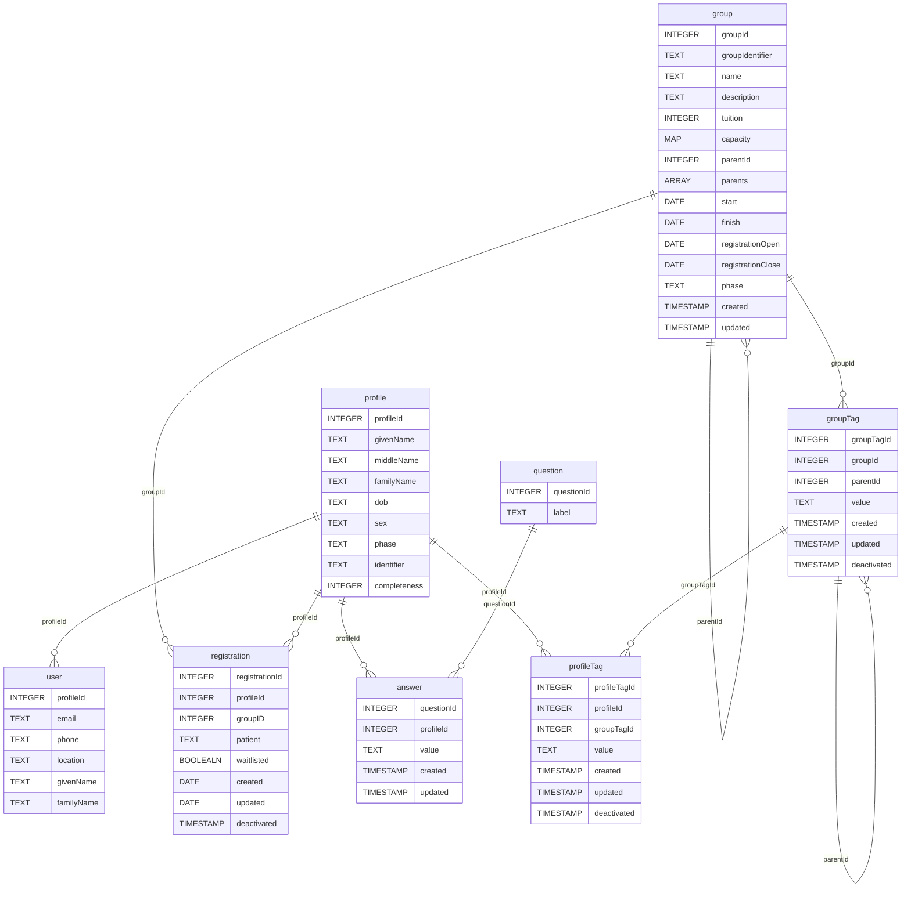

# Data Model

The API supports create, read, update, and/or delete for [profiles](./profiles.md), [registrations](./registrations.md), [group tags](./tags-groups.md), and [profile tags](./tags-profiles.md). It supports create, read, and delete for [users](./users.md). It only supports read for [groups](./groups.md), [questions](./questions-answers.md), and [answers](./questions-answers.md).

The diagram below shows the inter-relationships between these entities.

